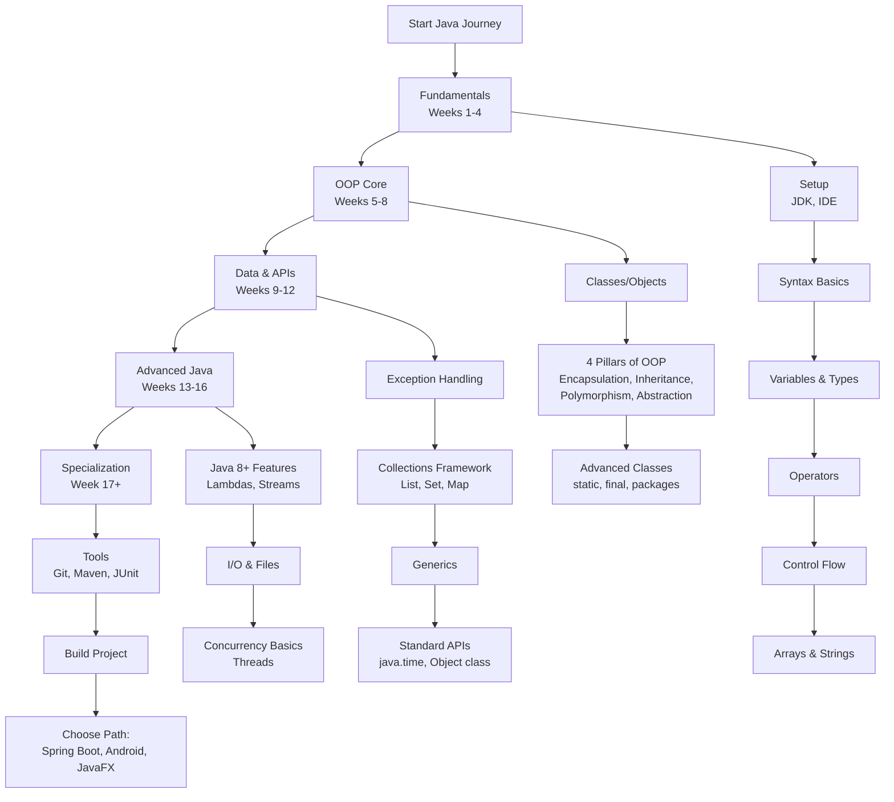

  
  
  

  

<h3 align=center>Full Stack Developer | Computer Science Student</h3>

### 👨🏻‍💻 About Me

- 👋 Hi, I’m `Ahmad Rizal`!
- 🎓 A passionate Software Engineering student at `Universitas AKPRIND Indonesia`.
- 💡 I love building web and mobile applications that solve real-world problems.
- 🛠️ My favorite tech like `Javascript`, `Typescript`, `Laravel`, and `Kotlin`.
- 🚀 Aspiring to become a `Full Stack Developer`, `focusing on scalability, performance`, and `great UI/UX`.
- 📍 Based in `Yogyakarta, Indonesia`.

Let’s `connect` and `collaborate!` 🚀

<picture>
  <source media="(prefers-color-scheme: dark)" srcset="https://raw.githubusercontent.com/ahmadrizal1st/ahmadrizal1st/output/github-snake-dark.svg" />
  <source media="(prefers-color-scheme: light)" srcset="https://raw.githubusercontent.com/ahmadrizal1st/ahmadrizal1st/output/github-snake.svg" />
  
</picture>

### 📊 My GitHub Stats

  
  

# Java Developer Learning Path: A Structured Curriculum

This comprehensive roadmap provides a structured approach to mastering Java development. The curriculum is designed sequentially, with each module building upon previous knowledge to ensure a solid foundation and progressive skill development.

---

## Phase 1: Core Fundamentals & Syntax (Weeks 1-4)
*   [**Module 1: Introduction & Development Environment**](https://github.com/ahmadrizal1st/java-intro/#readme)
*   [**Module 2: Basic Syntax & Program Structure**](https://github.com/ahmadrizal1st/java-syntax/#readme)
*   [**Module 3: Variables and Data Types**](https://github.com/ahmadrizal1st/java-variable/#readme)
*   [**Module 4: Operators and Expressions**](https://github.com/ahmadrizal1st/java-operators/#readme)
*   [**Module 5: Control Flow Statements**](https://github.com/ahmadrizal1st/java-flow/#readme)
*   [**Module 6: Arrays and Strings**](https://github.com/ahmadrizal1st/java-array/#readme)

---

## Phase 2: Object-Oriented Programming (OOP) Core (Weeks 5-8)
*   [**Module 7: Introduction to Classes and Objects**](https://github.com/ahmadrizal1st/java-classes/#readme)
*   [**Module 8: Core OOP Principles**](https://github.com/ahmadrizal1st/java-oop/#readme)
*   [**Module 9: Advanced Class Design**](https://github.com/ahmadrizal1st/java-advclasess/#readme)

---

## Phase 3: Data Handling & Standard APIs (Weeks 9-12)
*   [**Module 10: Exception Handling**](https://github.com/ahmadrizal1st/java-exception/#readme)
*   [**Module 11: Collections Framework**](https://github.com/ahmadrizal1st/java-collections/#readme)
*   [**Module 12: Generics**](https://github.com/ahmadrizal1st/java-generics/#readme)
*   [**Module 13: Essential Java APIs**](https://github.com/ahmadrizal1st/java-apis/#readme)

---

## Phase 4: Advanced Topics & Modern Java Features (Weeks 13-16)
*   [**Module 14: Functional Programming Features (Java 8+)**](https://github.com/ahmadrizal1st/java-8+/#readme)
*   [**Module 15: Input/Output (I/O) Operations**](https://github.com/ahmadrizal1st/java-io/#readme)
*   [**Module 16: Concurrency Fundamentals**](https://github.com/ahmadrizal1st/java-concurrency/#readme)

## Phase 5: Professional Development & Specialization
*   [**Module 17: Essential Development Tools**](https://github.com/ahmadrizal1st/java-dev/#readme)
*   [**Module 18: Capstone Project & Career Specialization**](https://github.com/ahmadrizal1st/java-capstone/#readme)
