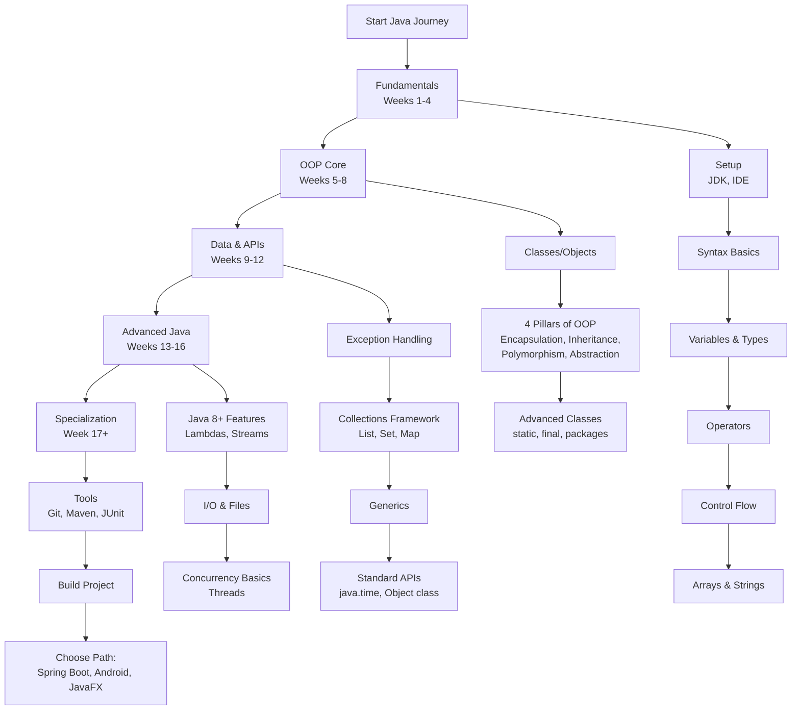

# Java Developer Learning Path: A Structured Curriculum

This comprehensive roadmap provides a structured approach to mastering Java development. The curriculum is designed sequentially, with each module building upon previous knowledge to ensure a solid foundation and progressive skill development.

---

## Phase 1: Core Fundamentals & Syntax (Weeks 1-4)
*   [**Module 1: Introduction & Development Environment**](https://github.com/ahmadrizal1st/java-intro/#readme)
*   [**Module 2: Basic Syntax & Program Structure**](https://github.com/ahmadrizal1st/java-syntax/#readme)
*   [**Module 3: Variables and Data Types**](https://github.com/ahmadrizal1st/java-variable/#readme)
*   [**Module 4: Operators and Expressions**](https://github.com/ahmadrizal1st/java-operators/#readme)
*   [**Module 5: Control Flow Statements**](https://github.com/ahmadrizal1st/java-flow/#readme)
*   [**Module 6: Arrays and Strings**](https://github.com/ahmadrizal1st/java-array/#readme)

---

## Phase 2: Object-Oriented Programming (OOP) Core (Weeks 5-8)
*   [**Module 7: Introduction to Classes and Objects**](https://github.com/ahmadrizal1st/java-classes/#readme)
*   [**Module 8: Core OOP Principles**](https://github.com/ahmadrizal1st/java-oop/#readme)
*   [**Module 9: Advanced Class Design**](https://github.com/ahmadrizal1st/java-advclasess/#readme)

---

## Phase 3: Data Handling & Standard APIs (Weeks 9-12)
*   [**Module 10: Exception Handling**](https://github.com/ahmadrizal1st/java-exception/#readme)
*   [**Module 11: Collections Framework**](https://github.com/ahmadrizal1st/java-collections/#readme)
*   [**Module 12: Generics**](https://github.com/ahmadrizal1st/java-generics/#readme)
*   [**Module 13: Essential Java APIs**](https://github.com/ahmadrizal1st/java-apis/#readme)

---

## Phase 4: Advanced Topics & Modern Java Features (Weeks 13-16)
*   [**Module 14: Functional Programming Features (Java 8+)**](https://github.com/ahmadrizal1st/java-8+/#readme)
*   [**Module 15: Input/Output (I/O) Operations**](https://github.com/ahmadrizal1st/java-io/#readme)
*   [**Module 16: Concurrency Fundamentals**](https://github.com/ahmadrizal1st/java-concurrency/#readme)

## Phase 5: Professional Development & Specialization
*   [**Module 17: Essential Development Tools**](https://github.com/ahmadrizal1st/java-dev/#readme)
*   [**Module 18: Capstone Project & Career Specialization**](https://github.com/ahmadrizal1st/java-capstone/#readme)
